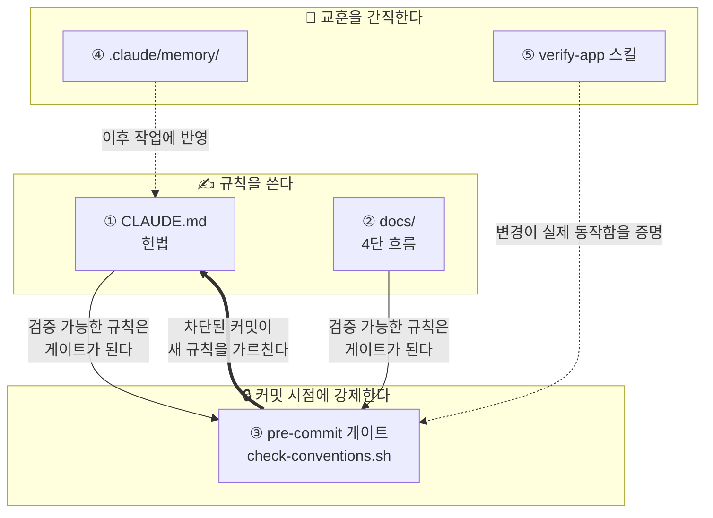
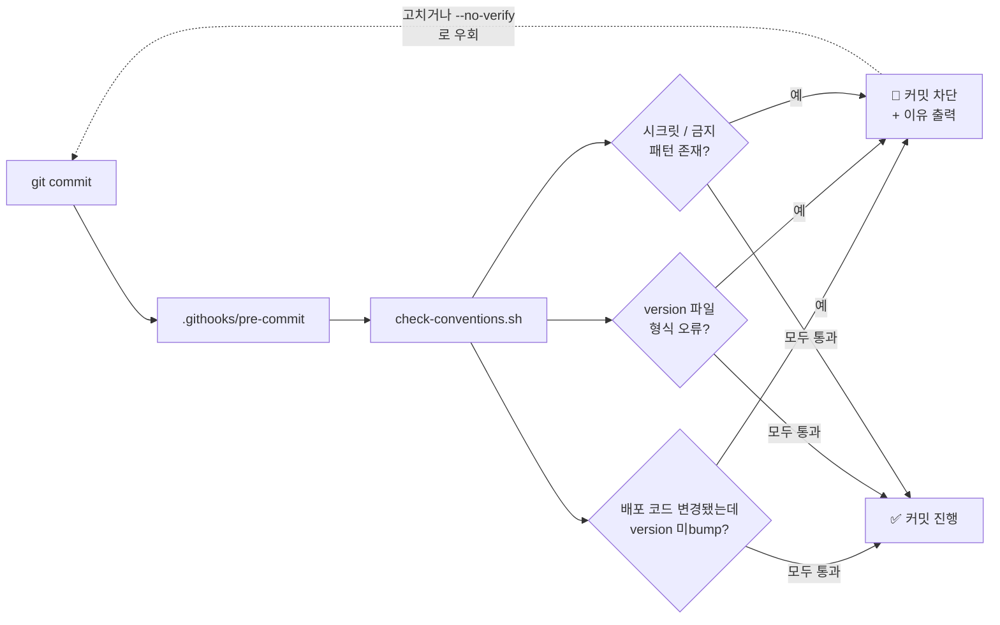
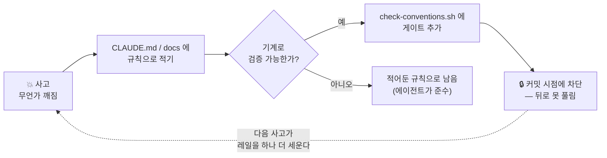

# ic-guardrails

> 🌐 **English ([README.md](README.md)) is the canonical, always-latest version.**
> 이 한글 문서는 편의를 위한 번역이며 영문판보다 뒤처질 수 있습니다. 내용이 다를 경우 **영문판이 정본**입니다.
> [English](README.md) · **한국어**

---

**AI 코딩 에이전트를 위한 가드레일(guardrail).** 회고(retro)를 pre-commit 게이트로 바꿔서 — 같은 실수가 두 번 배포되지 않고, 프로젝트의 규율이 궤도를 벗어나지 않게 한다.

대부분의 "AI 규칙" 세팅은 좋은 의도로 가득한 `CLAUDE.md` 한 장이지만 한 달이면 낡아버린다(stale). `ic-guardrails`은 그 나머지 반쪽이다: *적어둔* 규칙이 커밋 시점에 *기계적으로 강제*된다. 무언가 깨지면 게이트를 하나 추가하고 — 그 규칙은 다시 풀리지 않는다.

> 이름의 뜻: 가드레일은 속도를 늦추지 않는다 — 도로 밖으로 벗어나는 것을 막을 뿐이다. 이 도구가 프로젝트의 규칙에 하는 일이 바로 그것이다.

---

## 왜 만들었나

실제 플랫폼을 운영하며 뽑아낸 것이다: 하나의 허브 레포가 웹 프론트엔드 1개와 백엔드 서비스 약 17개(각자 배포 파이프라인 보유)를 총괄하는 구조. 이 규모에서는 같은 종류의 실수가 반복됐다:

- **조용한 미배포.** 코드는 바꿨는데 CI가 감시하는 트리거 파일을 bump 안 해서 — 파이프라인이 안 돌고 수정이 운영에 반영되지 않았다. 다시 깨질 때까지 아무도 몰랐다.
- **증발하는 규칙.** 어렵게 얻은 교훈("항상 X 하기")이 `CLAUDE.md`나 누군가의 머릿속에만 있다가 3주 뒤 잊혀지고 — 똑같은 사고가 재발했다.

규칙을 적어두는 것만으로는 부족했다. **문서는 나쁜 커밋을 막지 못한다. 좋은 커밋이 어떤 모습인지 설명할 뿐이다.** 해결책은 한 수였다: 기계가 검증할 수 있는 규칙은 전부 커밋 시점에 강제한다. version bump를 깜빡했다? 이유와 함께 커밋이 차단된다. 시크릿을 붙여넣었다? 차단.

그게 가드레일이다 — 사고 하나마다 레일이 하나씩 늘고, 계속 서 있다. 이 레포는 그 규율을 패키징해서 어떤 프로젝트든 명령 한 번으로 도입할 수 있게 한다.

---

## 무엇을 얻나

어떤 레포에든 넣을 수 있는 5축 스캐폴드:

| 축 | 파일 | 하는 일 |
|---|---|---|
| **1. 헌법(Constitution)** | `CLAUDE.md` | 에이전트가 매 세션 읽는 규칙: 작업 순서, 위임 책임, 강한 "하지 말 것"(각각 *왜*를 명시). |
| **2. 4단 문서 체계** | `docs/` | 변경이 코드가 되기 전에 spec → scope → backlog → done 흐름으로 문서화된다. |
| **3. 가드레일 게이트** ⭐ | `scripts/check-conventions.sh` + `.githooks/pre-commit` | 기계로 검증 가능한 규칙 위반 커밋을 차단: 배포 트리거 미bump, 잘못된 version 파일 형식, 시크릿/금지 패턴. |
| **4. 공유 메모리** | `.claude/memory/` + `scripts/setup-claude-memory.sh` | 세션을 넘어 지속되는 사실을 파일 1개=사실 1개로 인덱싱 — **git으로 버전 관리**돼 초기화돼도 교훈이 살아남고 팀과 공유된다. 범용 스타터 규칙 몇 개 포함. |
| **5. 검증 스킬** | `.claude/skills/verify-app/` | 일회성 스크립트 대신 재사용 가능한 end-to-end 검증. |

핵심은 축 3이 축 1로 이어지는 고리다: **검증 가능한 규칙을 낳은 회고는, 잊을 수 없는 게이트가 된다.**

---

## 아키텍처

5개 축은 세 가지 일로 나뉜다 — 규칙을 *쓰고*, *강제하고*, 교훈을 *간직한다* — 그리고 서로를 먹여 루프를 이룬다:



굵은 화살표가 핵심이다: 강제(enforce)가 다시 규칙으로 **되돌아 흐른다.** 차단된 커밋은 마찰이 아니라, 당신이 막 어기려던 규칙을 시스템이 가르쳐주는 순간이다.

### 커밋 시점에 일어나는 일



---

## 설치

> 설치 스크립트는 **스캐폴드 파일만 당신의 레포에 복사**한다. 자신은 temp
> 디렉토리에 내려받고 끝나면 지운다 — ic-guardrails의 레포/`.git`/`templates/`는
> 당신의 프로젝트에 남지 않는다. 기존 파일은 절대 덮어쓰지 않는다(덮어쓰려면 `--force`).

**A. 원라이너 — 프로젝트 루트에서 실행 (권장)**

```bash
curl -fsSL https://raw.githubusercontent.com/icurfer/ic-guardrails/main/install.sh | bash
# curl 없으면 →  wget -qO- https://raw.githubusercontent.com/icurfer/ic-guardrails/main/install.sh | bash
```

그다음 게이트 활성화 + 메모리 git 버전 관리:

```bash
bash scripts/install-hooks.sh        # 커밋 게이트 활성화
bash scripts/setup-claude-memory.sh  # 메모리 git 버전 관리 + 매 세션 로드
```

**B. Claude Code에 한 문구**

에이전트에게 이 레포를 가리키며 이렇게 말한다:

> "https://github.com/icurfer/ic-guardrails 의 curl 원라이너로 이 프로젝트에 ic-guardrails
> 스캐폴드를 구성해줘 (레포를 프로젝트 안에 clone하지 말고), 그다음 /guardrails-init를 돌려."

> ⚠️ **ic-guardrails를 프로젝트 *안에* `git clone`해서 거기서 실행하지 말 것** — 프로젝트에
> `ic-guardrails/` 폴더(자체 `.git` 포함)가 남아 오염된다. 로컬 사본을 두고 싶으면 프로젝트
> **바깥**에 clone한 뒤 `/path/to/ic-guardrails/install.sh /path/to/your/project` 로 실행한다.

그다음 Claude Code 안에서:

```
/guardrails-init  <프로젝트를 한 줄로 설명>
```

`/guardrails-init`은 레포를 분석해 `CLAUDE.md`와 게이트의 모든 `{{placeholder}}`를 채우고, 게이트를 실제 배포 경로에 맞게 튜닝한 뒤 — **일부러 잘못된 커밋을 만들어 차단되는 것을 보여줌으로써 동작을 증명한다.**

---

## 회고 루프 (무엇이 다른가)



사람의 기억에 의존하는 규칙은 언젠가 다시 깨진다. 이 체계는 사고 하나마다 가능한 많은 규칙을 게이트로 옮긴다.

---

## 게이트 커스터마이징

`scripts/check-conventions.sh` 상단의 설정 블록을 연다:

- `CODE_RE` — 변경 시 *반드시* 배포돼야 하는 경로 (→ version bump 필요)
- `VERSION_FILE` — CI가 트리거로 감시하는 파일
- `FORBIDDEN_PATTERNS` — 시크릿, 디버그 흔적, 금지 API

회고에서 검증 가능한 규칙이 나올 때마다 게이트를 추가한다. 그게 규율의 전부다.

## 스타터 규칙 — 맞는 것만 남기고 나머지는 지운다

`.claude/memory/` 에는 **범용** 작업 규칙 몇 개가 들어 있고, 각각
`(STARTER RULE — keep it or delete it.)` 로 표기돼 있다:

- `feedback_diagnose_before_assume` — 추정 전에 실제 probe 로 재현
- `feedback_no_quick_fix` — 진단 → 계획 → 구현; 진단을 건너뛰는 우회 금지
- `feedback_verify_before_done` — 완료 선언 전 end-to-end 로 동작 확인
- `feedback_push_is_one_cycle` — 코드 + 문서/작업내역 함께 push; 배포 묶기

이건 **법이 아니라 출발점이다.** 팀에 맞는 것만 남기고 나머지는 지운 뒤,
`.claude/memory/MEMORY.md` 의 해당 줄도 함께 정리한다. 진짜 가치는 *당신의* 사고가
가르쳐 준 규칙에서 나온다 — 그런 규칙을 그때그때 추가하라. (첫 셋업 때
`/guardrails-init` 이 취사선택을 도와준다.)

## 라이선스

Apache-2.0
