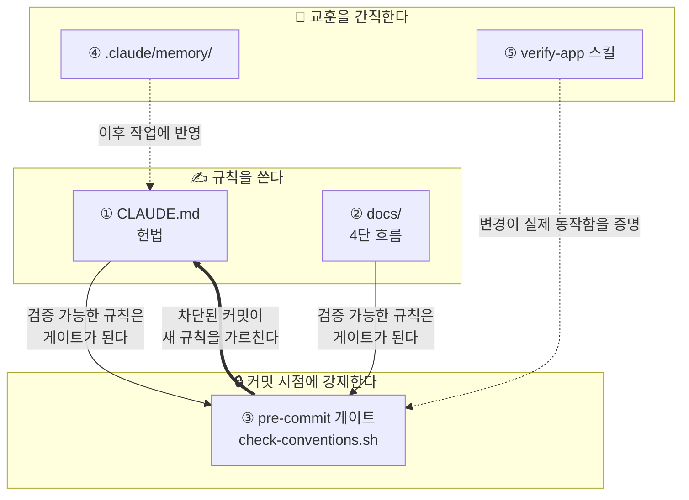
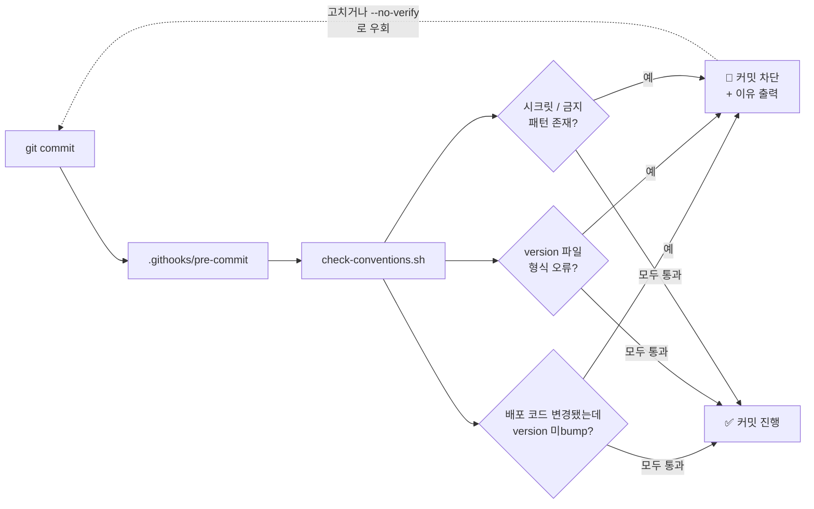
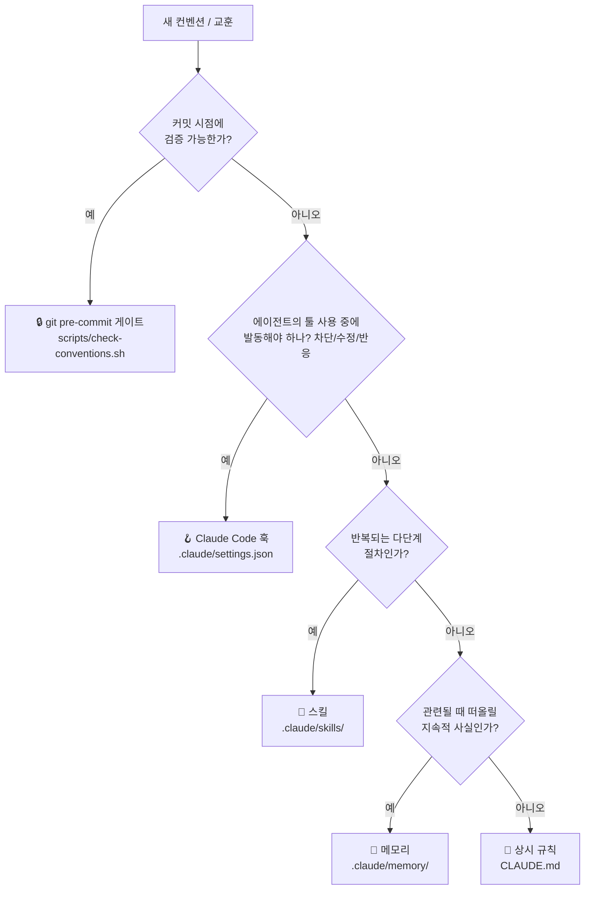
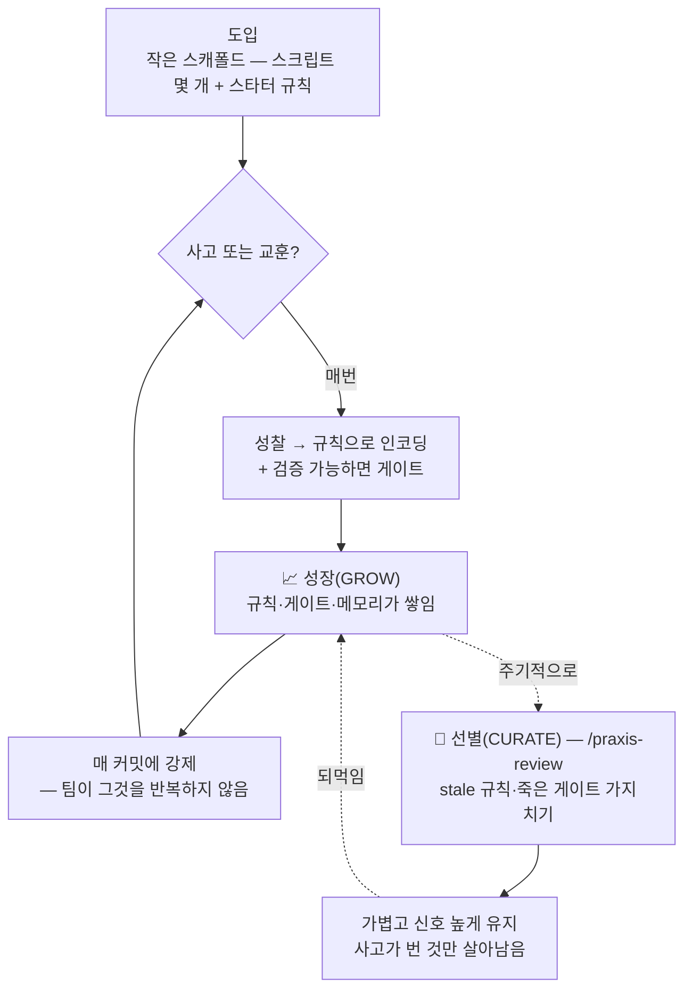

# ic-praxis

> 🌐 **English ([README.md](README.md)) is the canonical, always-latest version.**
> 이 한글 문서는 편의를 위한 번역이며 영문판보다 뒤처질 수 있습니다. 내용이 다를 경우 **영문판이 정본**입니다.
> [English](README.md) · **한국어**

---

**AI 코딩 에이전트를 위한 프락시스(praxis).** 성찰이 곧 실천이 된다 — 모든 회고(retro)가 pre-commit 게이트로 바뀌어, 같은 실수가 두 번 배포되지 않고 프로젝트가 스스로 배워 나간다.

대부분의 "AI 규칙" 세팅은 좋은 의도로 가득한 `CLAUDE.md` 한 장이지만 한 달이면 낡아버린다(stale). `ic-praxis`은 그 나머지 반쪽이다: *적어둔* 규칙이 커밋 시점에 *기계적으로 강제*된다. 무언가 깨지면 게이트를 하나 추가하고 — 그 규칙은 다시 풀리지 않는다.

> 이름의 뜻: *프락시스(praxis)* 는 성찰이 실천으로 바뀌는 것 — 교훈을 얻으면, 그것을 강제한다. 이 도구는 프로젝트의 규칙에 대해 그 순환을 자동화해, 팀(과 에이전트)이 문제를 반복이 아니라 한 번에 해결하도록 키운다.

---

## 왜 만들었나

실제 플랫폼을 운영하며 뽑아낸 것이다: 하나의 허브 레포가 웹 프론트엔드 1개와 백엔드 서비스 약 17개(각자 배포 파이프라인 보유)를 총괄하는 구조. 이 규모에서는 같은 종류의 실수가 반복됐다:

- **조용한 미배포.** 코드는 바꿨는데 CI가 감시하는 트리거 파일을 bump 안 해서 — 파이프라인이 안 돌고 수정이 운영에 반영되지 않았다. 다시 깨질 때까지 아무도 몰랐다.
- **증발하는 규칙.** 어렵게 얻은 교훈("항상 X 하기")이 `CLAUDE.md`나 누군가의 머릿속에만 있다가 3주 뒤 잊혀지고 — 똑같은 사고가 재발했다.

규칙을 적어두는 것만으로는 부족했다. **문서는 나쁜 커밋을 막지 못한다. 좋은 커밋이 어떤 모습인지 설명할 뿐이다.** 해결책은 한 수였다: 기계가 검증할 수 있는 규칙은 전부 커밋 시점에 강제한다. version bump를 깜빡했다? 이유와 함께 커밋이 차단된다. 시크릿을 붙여넣었다? 차단.

그게 프락시스다 — 사고 하나마다 프로젝트가 스스로에게 강제하는 규칙이 되어, 같은 교훈을 다시 배우지 않는다. 이 레포는 그 순환을 패키징해서 어떤 프로젝트든 명령 한 번으로 도입할 수 있게 한다.

---

## 무엇을 얻나

어떤 레포에든 넣을 수 있는 5축 스캐폴드:

| 축 | 파일 | 하는 일 |
|---|---|---|
| **1. 헌법(Constitution)** | `CLAUDE.md` | 에이전트가 매 세션 읽는 규칙: 작업 순서, 위임 책임, 강한 "하지 말 것"(각각 *왜*를 명시). |
| **2. 4단 문서 체계** | `docs/` | 변경이 코드가 되기 전에 spec → scope → backlog → done 흐름으로 문서화된다. |
| **3. praxis 게이트** ⭐ | `scripts/check-conventions.sh` + `.githooks/pre-commit` | 기계로 검증 가능한 규칙 위반 커밋을 차단: 배포 트리거 미bump, 잘못된 version 파일 형식, 시크릿/금지 패턴. |
| **4. 공유 메모리** | `.claude/memory/` + `scripts/setup-claude-memory.sh` | 세션을 넘어 지속되는 사실을 파일 1개=사실 1개로 인덱싱 — **git으로 버전 관리**돼 초기화돼도 교훈이 살아남고 팀과 공유된다. 범용 스타터 규칙 몇 개 포함. |
| **5. 검증 스킬** | `.claude/skills/verify-app/` | 일회성 스크립트 대신 재사용 가능한 end-to-end 검증. |

핵심은 축 3이 축 1로 이어지는 고리다: **검증 가능한 규칙을 낳은 회고는, 잊을 수 없는 게이트가 된다.**

이 다섯은 **코어**로 항상 적용된다. 형태에 종속된 관심사(모노레포, 여러 세션 병렬,
k8s 배포)는 맞는 곳에서만 켜는 [옵트인 모듈](#선택-적용--모듈)이라, 단순한 레포는 단순하게
유지된다.

---

## 아키텍처

5개 축은 세 가지 일로 나뉜다 — 규칙을 *쓰고*, *강제하고*, 교훈을 *간직한다* — 그리고 서로를 먹여 루프를 이룬다:



굵은 화살표가 핵심이다: 강제(enforce)가 다시 규칙으로 **되돌아 흐른다.** 차단된 커밋은 마찰이 아니라, 당신이 막 어기려던 규칙을 시스템이 가르쳐주는 순간이다.

### 커밋 시점에 일어나는 일



---

## 설치

> **그냥 돌리기보다, AI 에이전트와 *함께* 도입하는 것이 최선이다.** 설치 스크립트는
> 범용 파일을 복사할 뿐이고, 가치는 그것을 *당신의* 레포에 맞추는 데서 나온다 — 게이트를
> 실제 배포 경로에 튜닝하고, 프로젝트 형태가 필요로 하는 [모듈](#선택-적용--모듈)만 켜는
> 것(모노레포? 여러 세션 병렬? k8s 배포?). 이건 판단이 필요한 대화이고, `/praxis-init`이
> 바로 그 대화를 당신과 나누도록 만들어졌다. 설치만 하고 손 떼면 절반만 맞는 범용
> 스캐폴드가 남는데 — 그게 바로 이 도구가 없애려는 "낡아버리는 규칙" 문제다.
> **에이전트가 당신과 함께 도입하게 하라.**

> 설치 스크립트 자체는 **스캐폴드 파일만 당신의 레포에 복사**한다. 자신은 temp
> 디렉토리에 내려받고 끝나면 지운다 — ic-praxis의 레포/`.git`/`templates/`는
> 당신의 프로젝트에 남지 않는다. 기존 파일은 절대 덮어쓰지 않는다(덮어쓰려면 `--force`).

**A. AI 에이전트와 함께 도입 (권장)**

에이전트(Claude Code)에게 이 레포를 가리키며 이렇게 말한다:

> "https://github.com/icurfer/ic-praxis 의 curl 원라이너로 이 프로젝트에 ic-praxis
> 스캐폴드를 구성해줘 (레포를 프로젝트 안에 clone하지 말고), 그다음 /praxis-init를 돌려."

그다음 Claude Code 안에서:

```
/praxis-init  <프로젝트를 한 줄로 설명>
```

`/praxis-init`은 레포를 분석해 `CLAUDE.md`와 게이트의 모든 `{{placeholder}}`를 채우고,
**프로젝트 형태를 감지해 어떤 모듈을 켤지 당신과 확인**하고, 게이트를 실제 배포 경로에
맞게 튜닝한 뒤 — **일부러 잘못된 커밋을 만들어 차단되는 것을 보여줌으로써 동작을 증명한다.**

> ⚠️ **ic-praxis를 프로젝트 *안에* `git clone`해서 거기서 실행하지 말 것** — 프로젝트에
> `ic-praxis/` 폴더(자체 `.git` 포함)가 남아 오염된다. 로컬 사본을 두고 싶으면 프로젝트
> **바깥**에 clone한 뒤 `/path/to/ic-praxis/install.sh /path/to/your/project` 로 실행한다.

**B. 원시 설치 스크립트 (스크립트/CI용)**

```bash
curl -fsSL https://raw.githubusercontent.com/icurfer/ic-praxis/main/install.sh | bash
# curl 없으면 →  wget -qO- https://raw.githubusercontent.com/icurfer/ic-praxis/main/install.sh | bash
#
# 플래그: --multi-session (허브 + 병렬 세션)  --no-version (영역별 version 레포)
#         --no-docs (이미 문서 체계 있음)       --force (덮어쓰기)
```

그다음 게이트 활성화 + 메모리 git 버전 관리:

```bash
bash scripts/install-hooks.sh        # 커밋 게이트 활성화
bash scripts/setup-claude-memory.sh  # 메모리 git 버전 관리 + 매 세션 로드
```

원시 설치 스크립트를 돌린 뒤에도 `/praxis-init`은 꼭 실행하라 — 에이전트가 이 프로젝트에
맞게 튜닝하기 전까지 스캐폴드는 범용인 채로 남는다.

---

## 회고 루프 (무엇이 다른가)


사람의 기억에 의존하는 규칙은 언젠가 다시 깨진다. 이 체계는 사고 하나마다 가능한 많은 규칙을 게이트로 옮긴다.

---

## 새 규칙을 어디에 넣나 (라우팅)

회고는 규칙을 낳는다 — 하지만 그것을 *어느 레이어*에 두느냐가 도움이 될지, 아니면
매 세션에 세금만 물릴지를 가른다. ic-praxis는 새 컨벤션을 알맞은 자리로 보낸다:



| 자리 | 발동 시점 | 여기에 넣는 것 |
|---|---|---|
| **git 게이트** `check-conventions.sh` | 매 `git commit` | 기계로 검증되는 필수(version bump·시크릿·파일 형식) |
| **Claude Code 훅** `.claude/settings.json` | 매칭되는 툴 호출, 작업 도중 | 에이전트 행동을 차단/자동수정/반응(쓰기 시 포맷, 경로 차단) |
| **스킬** `.claude/skills/` | 매칭되는 작업, 필요 시 | 반복 절차(검증·배포) |
| **메모리** `.claude/memory/` | 관련성으로 소환 | 지속적 프로젝트 사실·피드백 |
| **CLAUDE.md 규칙** | 매 세션 상시 로드 | 에이전트가 항상 지켜야 할 판단 컨벤션 |

원칙: **더 기계적이고 더 자주 발동해야 할수록 더 단단한 레이어**(게이트 → 훅 → 스킬
→ 메모리 → 상시 규칙). 좁은 규칙을 상시 로드 레이어에 넣으면 무관한 모든 세션에
조용히 세금을 물린다. `/praxis-init`이 셋업 때 각 규칙의 자리를 잡아 주고,
`/praxis-review`가 프로젝트가 자라며 배치를 다시 점검한다.

---

## 게이트 커스터마이징

`scripts/check-conventions.sh` 상단의 설정 블록을 연다:

- `AREA_CODE_RE` / `AREA_VFILE` — 병렬 배열: 각 배포 단위마다 *반드시* 배포돼야 하는
  코드 경로 → 함께 bump돼야 하는 배포 트리거 파일. 단일 배포 레포는 영역 1개, 모노레포는
  단위마다 하나씩.
- `FORBIDDEN_PATTERNS` + `key: value` 시크릿 게이트 — 시크릿(`foo = "..."` 와 YAML/Helm
  `foo: "..."` 둘 다 커버), 디버그 흔적, 금지 API.
- `DEPLOY_MANIFESTS` *(선택)* — version bump를 Helm/k8s/compose 매니페스트의 이미지 태그와
  동기화 → bump만 올라가고 옛 이미지가 배포되는 것을 막는다.

회고에서 검증 가능한 규칙이 나올 때마다 게이트를 추가한다. 그게 규율의 전부다.

## 선택 적용 — 모듈

ic-praxis는 한 레포의 형태에서 출발했지만, 모든 프로젝트가 그 형태는 아니다. 코어(헌법 +
게이트 + 문서 + 메모리 + 검증)는 항상 적용된다. 형태에 종속된 것은 전부 **옵트인 모듈**이다
— `/praxis-init`이 레포를 감지해 각각을 당신과 확인하거나, 설치 플래그로 명시한다:

| 모듈 | 켜는 때 | 추가되는 것 | 활성화 |
|---|---|---|---|
| **monorepo** | 배포 단위 >1 | 영역별 `AREA_CODE_RE`/`AREA_VFILE`, 루트 `version` 없음 | `/praxis-init` 감지 · `--no-version` |
| **multi-session** | 여러 세션을 병렬로 굴리는 허브 | `.claude/agents/worker.md`(하위 단위 전용 워커) + `.claude/settings.json` push 전 리마인더 + CLAUDE.md 다중세션 규칙 | `install.sh --multi-session` · `/praxis-init` 질문 |
| **deploy-manifest** | k8s / Helm / compose | `DEPLOY_MANIFESTS` 동기 게이트(version ↔ 이미지 태그) | `/praxis-init` 감지 |

**multi-session** 모듈이 존재하는 이유: 5축은 *단일* 세션을 잘 규율하지만, 하나의 작업
트리를 공유하는 독립 세션들은 서로의 허브 편집을 조용히 덮어쓴다(git이 충돌을 못 본다).
모듈의 답: 메인 세션 1개 + 각자 하위 단위 하나만 맡고 요약을 되돌려주는 서브에이전트 —
그래서 공유 상태는 메인 세션이 단독으로 쓴다. 단일 세션 프로젝트는 꺼두면 된다. 켜두면
세금만 문다.

## 게이트가 하지 *않는* 것

게이트는 **규율 누락**(잊은 version bump, 붙여넣은 시크릿, 깨진 파일 형식)을 막지,
**논리 버그**를 막지 않는다. 실제 316커밋 도입 사례에서 측정하니, 게이트는 version bump
누락과 시크릿 유출은 잡았을 것이고 — `fix:` 커밋 57건 중 0건을 잡았다. 기대치를 그렇게
맞춰라: 가치는 반복되는 "뒷수습" 커밋 제거와 조용한 미배포 차단이지, 버그 잡기가 아니다.

## 스타터 규칙 — 맞는 것만 남기고 나머지는 지운다

`.claude/memory/` 에는 **범용** 작업 규칙 몇 개가 들어 있고, 각각
`(STARTER RULE — keep it or delete it.)` 로 표기돼 있다:

- `feedback_diagnose_before_assume` — 추정 전에 실제 probe 로 재현
- `feedback_no_quick_fix` — 진단 → 계획 → 구현; 진단을 건너뛰는 우회 금지
- `feedback_verify_before_done` — 완료 선언 전 end-to-end 로 동작 확인
- `feedback_push_is_one_cycle` — 코드 + 문서/작업내역 함께 push; 배포 묶기

이건 **법이 아니라 출발점이다.** 팀에 맞는 것만 남기고 나머지는 지운 뒤,
`.claude/memory/MEMORY.md` 의 해당 줄도 함께 정리한다. 진짜 가치는 *당신의* 사고가
가르쳐 준 규칙에서 나온다 — 그런 규칙을 그때그때 추가하라. (첫 셋업 때
`/praxis-init` 이 취사선택을 도와준다.)

## 함께 자라고 — 선별된 채로 유지된다

이 체계는 **자라도록** 설계됐다: 사고 하나마다 규칙·게이트·메모리가 하나씩 쌓인다.
그 복리가 핵심이지만, 선별 없는 성장은 노이즈(stale 규칙·죽은 게이트·어긋난 인덱스)가
된다. 그래서 두 힘이 균형을 이룬다 — **성장**(성찰 → 새 규칙)과 **선별**(더 이상
제 몫을 못 하는 것 가지치기):



**선별** 반쪽을 담당하는 두 명령:

```bash
bash scripts/praxis-review.sh   # 구조적 sprawl: 고아/dangling 메모리, 성장 통계
```
```
/praxis-review                  # + 판단: stale 규칙·죽은 게이트 가지치기 (제안 후 확인)
```

결과는 **작게 시작해, 당신의 사고가 번 것만 자라고, 스스로 선별되는** 체계다 —
첫날부터 남의 메가 프레임워크를 통째로 짊어지는 것과 정반대다.

## 라이선스

Apache-2.0
