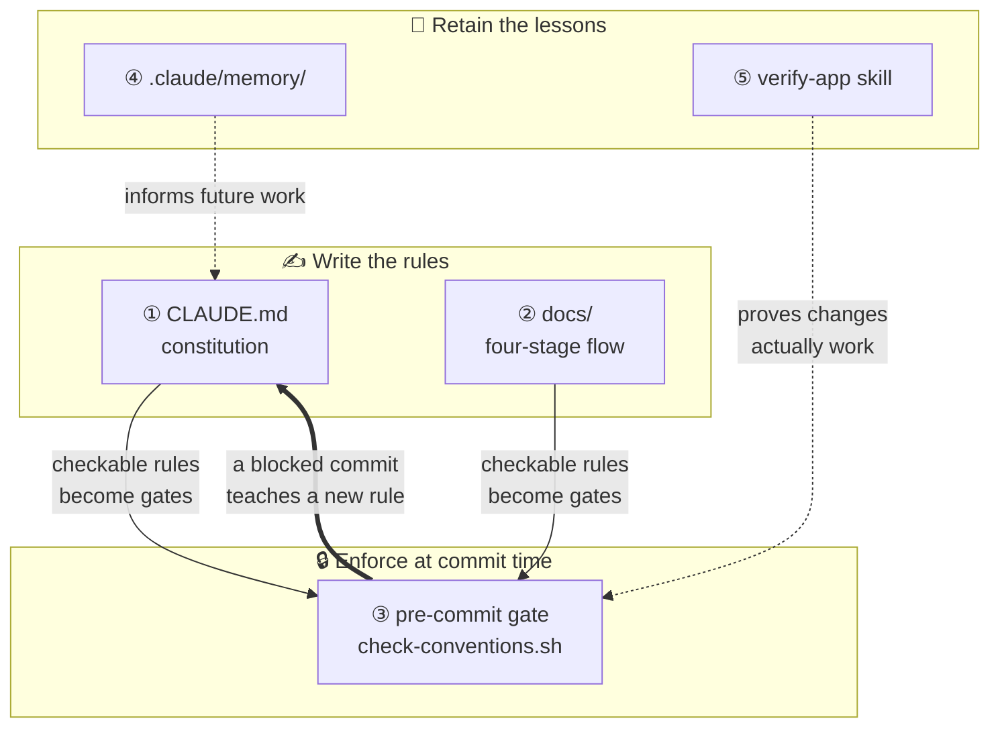
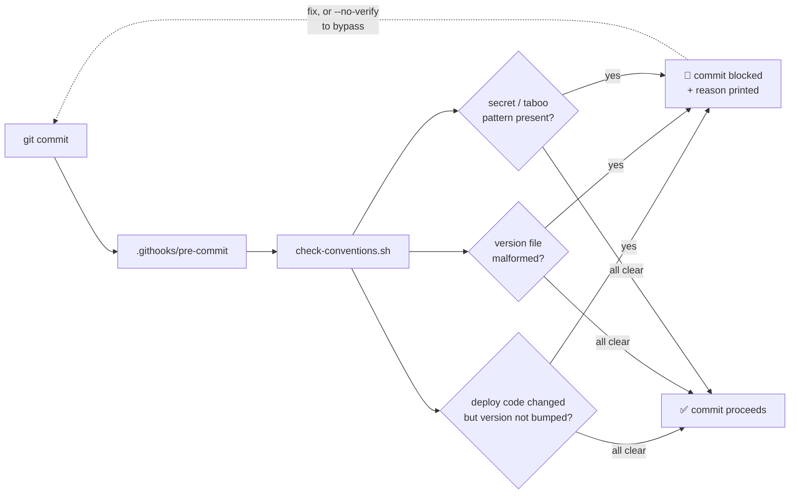
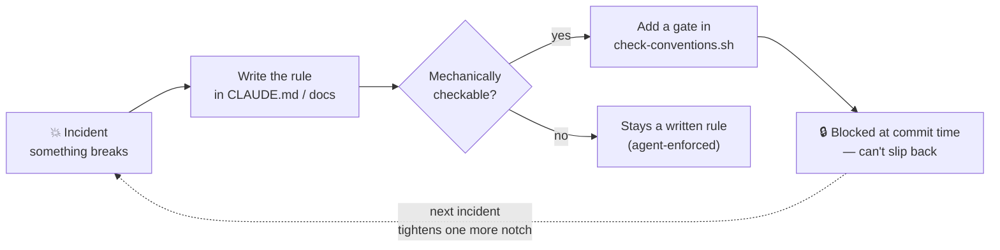

# ic-ratchet

> **English** · [한국어](README.ko.md)

**A quality ratchet for AI coding agents.** Retros become pre-commit gates — so the same mistake can't ship twice, and your project's discipline never slips back.

Most "AI rules" setups are a `CLAUDE.md` full of good intentions that go stale in a month. `ic-ratchet` is the missing half: the rules you *write down* get *mechanically enforced* at commit time. When something breaks, you add a gate — and it stays fixed.

> The name: a ratchet turns one way and won't slip back. That's what this does to a project's conventions.

---

## Why ic-ratchet exists

It was extracted from running a real platform: a single hub repo coordinating one web frontend and ~17 backend services, each with its own deploy pipeline. At that scale, the same class of mistake kept recurring:

- **Silent non-deploys.** A code change shipped, but the file CI watches to trigger a build wasn't bumped — so the pipeline never fired and the fix never reached production. Nobody noticed until it broke again.
- **Rules that evaporate.** A lesson learned the hard way ("always do X") lived in a `CLAUDE.md` or in someone's head, and was forgotten three weeks later — reproducing the exact same incident.

Writing rules down wasn't enough. **Documents don't stop a bad commit; they only describe what a good one looks like.** The fix was one move: take every rule a machine *can* check, and enforce it at commit time. Forget the version bump? The commit is blocked, with the reason printed. Paste a secret? Blocked.

That is the ratchet — each incident tightens it one notch, and it never loosens. This repo packages that discipline so any project can adopt it in one command.

---

## What you get

A five-axis scaffold, dropped into any repo:

| Axis | File(s) | What it does |
|---|---|---|
| **1. Constitution** | `CLAUDE.md` | Rules the agent reads every session: work order, delegated responsibilities, hard "Do NOT"s (each with its *why*). |
| **2. Four-stage docs** | `docs/` | Change freezes into a spec → scope → backlog → done trail before it becomes code. |
| **3. The ratchet gate** ⭐ | `scripts/check-conventions.sh` + `.githooks/pre-commit` | Blocks commits that violate mechanically-checkable rules: deploy-trigger not bumped, malformed version file, secret/taboo patterns. |
| **4. Shared memory** | `.claude/memory/` + `scripts/setup-claude-memory.sh` | Cross-session facts, one per file, indexed — **git-versioned** so lessons survive resets and are shared with the team. Ships a few universal starter rules. |
| **5. Verify skill** | `.claude/skills/verify-app/` | Reusable end-to-end checks instead of throwaway scripts. |

The heart is axis 3 feeding axis 1: **a retro that produces a checkable rule becomes a gate that can't be forgotten.**

---

## Architecture

The five axes split into three jobs — *write* rules, *enforce* them, *retain* the lessons — and feed each other in a loop:



The bold arrow is the point: enforcement flows **back** into the written rules. A commit that gets blocked isn't friction — it's the system teaching you the rule you were about to break.

### What happens at commit time



---

## Install

> The installer only **copies the scaffold files into your repo**. It downloads
> itself to a temp dir and cleans up — ic-ratchet's own repo/`.git`/`templates/`
> are never left in your project. Existing files are never overwritten (use
> `--force` to replace).

**A. One-liner — run at your project root (recommended)**

```bash
curl -fsSL https://raw.githubusercontent.com/icurfer/ic-ratchet/main/install.sh | bash
# no curl? →  wget -qO- https://raw.githubusercontent.com/icurfer/ic-ratchet/main/install.sh | bash
```

Then activate the gate and git-version the memory:

```bash
bash scripts/install-hooks.sh        # activate the commit gate
bash scripts/setup-claude-memory.sh  # git-version memory + load it each session
```

**B. One phrase in Claude Code**

Point your agent at this repo and say:

> "Scaffold ic-ratchet into this project using the curl one-liner from
> https://github.com/icurfer/ic-ratchet (do not clone it into the project), then run /ratchet-init."

> ⚠️ **Don't `git clone` ic-ratchet *inside* your project and run it there** — that
> leaves an `ic-ratchet/` folder (with its own `.git`) in your repo. If you want a
> local copy, clone it **outside** your project and run
> `/path/to/ic-ratchet/install.sh /path/to/your/project`.

Then, inside Claude Code:

```
/ratchet-init  <one line describing your project>
```

`/ratchet-init` inspects your repo, fills every `{{placeholder}}` in `CLAUDE.md` and the gate, tunes the gate to your real deploy paths — and **proves it works by making a deliberately-bad commit and showing it blocked.**

---

## The retro loop (why this is different)



Rules that depend on human memory break again. This moves as many as possible into the gate, one incident at a time.

---

## Customizing the gate

Open `scripts/check-conventions.sh` — the config block at the top:

- `CODE_RE` — paths whose change *must* be deployed (→ requires a version bump)
- `VERSION_FILE` — the file your CI triggers on
- `FORBIDDEN_PATTERNS` — secrets, debug leftovers, banned APIs

Add a new gate whenever a retro gives you a checkable rule. That's the whole discipline.

## License

Apache-2.0
