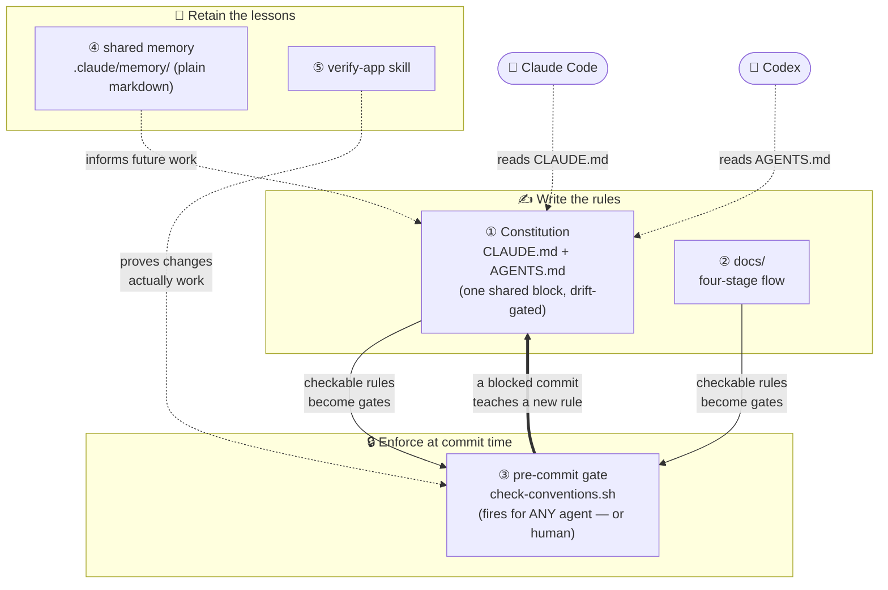
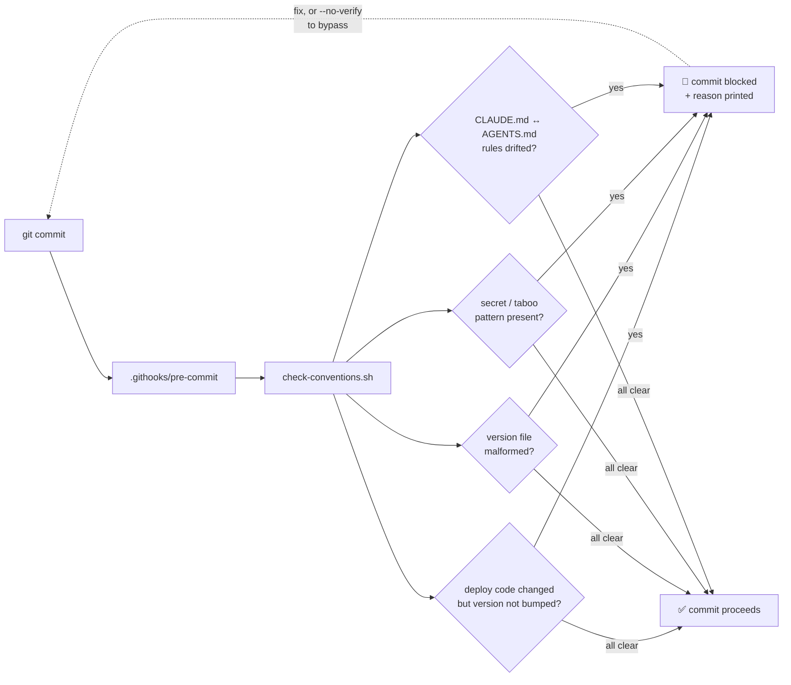
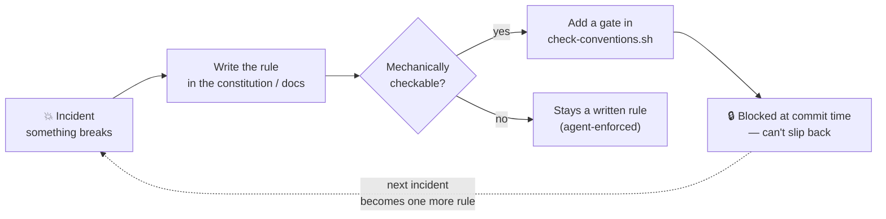
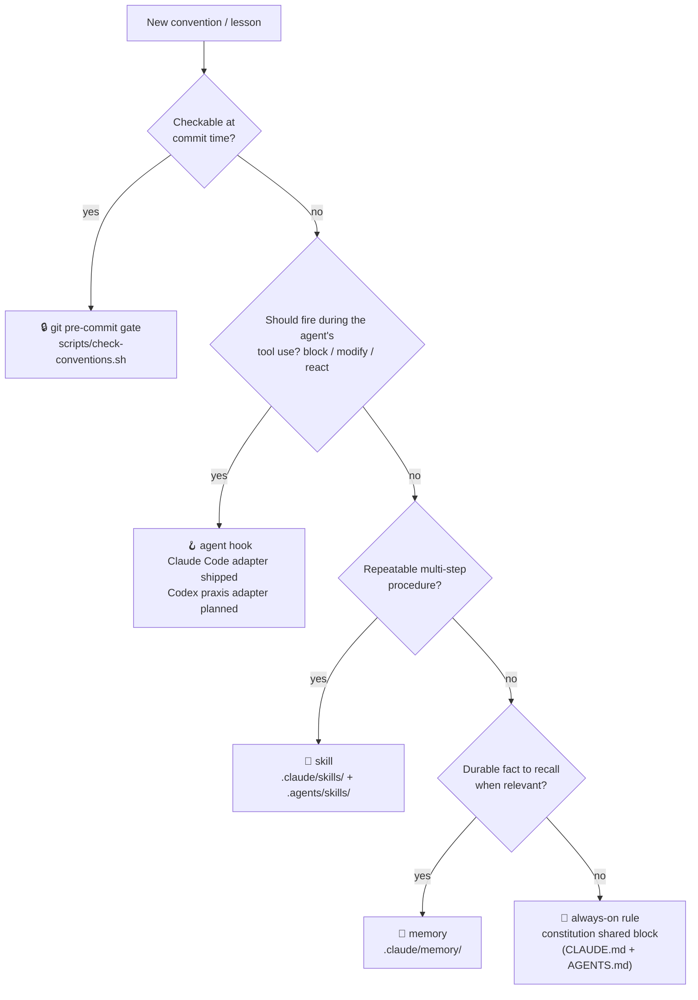
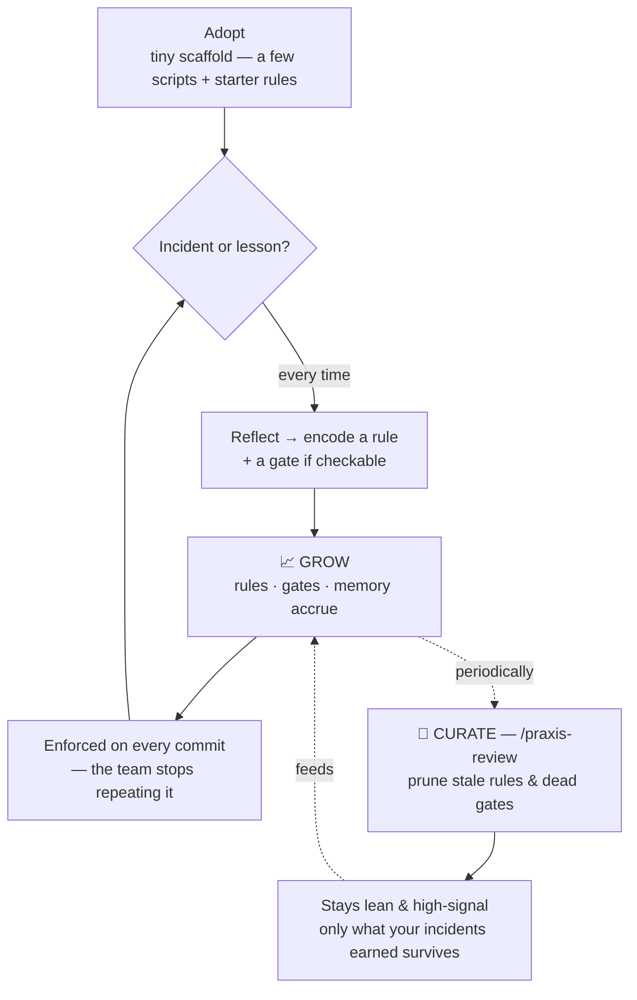

# ic-praxis

> **English** · [한국어](README.ko.md)

**Praxis for AI coding agents.** Reflection becomes action — every retro turns into a pre-commit gate, so the same mistake can't ship twice and your project keeps teaching itself.

Most "AI rules" setups are a `CLAUDE.md` full of good intentions that go stale in a month. `ic-praxis` is the missing half: the rules you *write down* get *mechanically enforced* at commit time. When something breaks, you add a gate — and it stays fixed.

> The name: *praxis* is reflection turned into action — you learn a lesson, then you enforce it. This automates that loop for a project's conventions, so the team (and its agents) grow into solving problems once, not repeatedly.

---

## Why ic-praxis exists

It was extracted from running a real platform: a single hub repo coordinating one web frontend and ~17 backend services, each with its own deploy pipeline. At that scale, the same class of mistake kept recurring:

- **Silent non-deploys.** A code change shipped, but the file CI watches to trigger a build wasn't bumped — so the pipeline never fired and the fix never reached production. Nobody noticed until it broke again.
- **Rules that evaporate.** A lesson learned the hard way ("always do X") lived in a `CLAUDE.md` or in someone's head, and was forgotten three weeks later — reproducing the exact same incident.

Writing rules down wasn't enough. **Documents don't stop a bad commit; they only describe what a good one looks like.** The fix was one move: take every rule a machine *can* check, and enforce it at commit time. Forget the version bump? The commit is blocked, with the reason printed. Paste a secret? Blocked.

That is praxis — each incident becomes a rule the project enforces on itself, so it never re-learns the same lesson. This repo packages that loop so any project can adopt it in one command.

---

## What you get

A five-axis scaffold, dropped into any repo:

| Axis | File(s) | What it does |
|---|---|---|
| **1. Constitution** | `CLAUDE.md` + `AGENTS.md` | Rules the agent reads every session: work order, delegated responsibilities, hard "Do NOT"s (each with its *why*). One shared rule block, mirrored in both files and **drift-gated** — Claude Code and Codex read the same law. |
| **2. Four-stage docs** | `docs/` | Change freezes into a spec → scope → backlog → done trail before it becomes code. |
| **3. The praxis gate** ⭐ | `scripts/check-conventions.sh` + `.githooks/pre-commit` | Blocks commits that violate mechanically-checkable rules: deploy-trigger not bumped, malformed version file, secret/taboo patterns. |
| **4. Shared memory** | `.claude/memory/` + `scripts/setup-claude-memory.sh` | Cross-session facts, one per file, indexed — **git-versioned** so lessons survive resets and are shared with the team. Ships a few universal starter rules. |
| **5. Verify skill** | `.claude/skills/verify-app/` + `.agents/skills/verify-app/` | Reusable end-to-end checks instead of throwaway scripts; Claude Code and Codex each get a native entrypoint to one canonical procedure. |

The heart is axis 3 feeding axis 1: **a retro that produces a checkable rule becomes a gate that can't be forgotten.**

Those five are the **core** — always applied. Shape-specific concerns (monorepo,
multiple parallel sessions, k8s deploy) are [opt-in modules](#selective-application--modules)
you turn on only where they fit, so a simple repo stays simple.

### Which agents does it work with?

Praxis owns the rules; agents only provide entrypoints. The enforcement layer
(git hook) is agent-neutral by construction — it fires no matter *what* staged
the commit. The constitution ships as two native entrypoints sharing one
marker-delimited rule block, and **Gate E blocks any commit where the two
drift** — so switching between Claude Code and Codex never splits the rules.

| Layer | Claude Code | Codex (`AGENTS.md` readers) |
|---|---|---|
| Constitution | `CLAUDE.md` — native | `AGENTS.md` — native, **drift-gated** against `CLAUDE.md` |
| Commit gate + `docs/` flow | portable (agent-independent) | portable |
| Memory `.claude/memory/` | auto-loaded each session | read-on-demand — `AGENTS.md` routes to the `MEMORY.md` index |
| Skills | `.claude/skills/` — native | `.agents/skills/` — native thin adapters to the same canonical procedures |
| Hooks / sub-agents (`.claude/settings.json`, `.claude/agents/`) | native | Codex supports native equivalents, but praxis adapters are not shipped yet |

Only using one agent? Delete the entrypoint you don't use — the gate only
checks sync when both files exist.

AI commits stay identifiable: `AGENTS.md` ships a `Co-Authored-By` trailer rule
so Codex commits are marked as AI-assisted on GitHub, like Claude Code's
automatic trailer. Team policy differs? `/praxis-init` asks and removes it.

---

## Architecture

The five axes split into three jobs — *write* rules, *enforce* them, *retain* the lessons — and feed each other in a loop:



The bold arrow is the point: enforcement flows **back** into the written rules. A commit that gets blocked isn't friction — it's the system teaching you the rule you were about to break.

### What happens at commit time



---

## Install

> **Best adopted *with* an AI agent, not just run.** The installer only copies
> generic files; the value comes from adapting them to *your* repo — tuning the
> gate to real deploy paths, and turning on only the [modules](#selective-application--modules)
> your project shape needs (monorepo? multiple parallel sessions? k8s deploy?).
> That's a judgment conversation, and `/praxis-init` is built to have it with you.
> Running the raw installer and walking away gives you a generic scaffold that
> only half-fits — which is exactly the "rules that go stale" problem this tool
> exists to solve. **Let an agent adopt it with you.**

> The installer itself only **copies the scaffold files into your repo**. It
> downloads itself to a temp dir and cleans up — ic-praxis' own
> repo/`.git`/`templates/` are never left in your project. Existing files are
> never overwritten (use `--force` to replace).

**A. Adopt with an AI agent (recommended)**

Point your agent (Claude Code or Codex) at this repo and say:

> "Scaffold ic-praxis into this project using the curl one-liner from
> https://github.com/icurfer/ic-praxis (do not clone it into the project), then run /praxis-init."

Then, inside Claude Code:

```
/praxis-init  <one line describing your project>
```

Using Codex? The scaffold installs a native repo skill:

```
$praxis-init  <one line describing your project>
```

The thin `.agents/skills/praxis-init/` adapter follows the same canonical
procedure as Claude Code, so both `CLAUDE.md` and `AGENTS.md` get filled from
one shared rule block and the gate keeps them in sync.

`/praxis-init` inspects your repo, fills every `{{placeholder}}` in `CLAUDE.md`
and the gate, **detects your project shape and confirms with you which modules to
turn on**, tunes the gate to your real deploy paths — and **proves it works by
making a deliberately-bad commit and showing it blocked.**

> ⚠️ **Don't `git clone` ic-praxis *inside* your project and run it there** — that
> leaves an `ic-praxis/` folder (with its own `.git`) in your repo. If you want a
> local copy, clone it **outside** your project and run
> `/path/to/ic-praxis/install.sh /path/to/your/project`.

**B. Raw installer (scripted / CI use)**

```bash
curl -fsSL https://raw.githubusercontent.com/icurfer/ic-praxis/main/install.sh | bash
# no curl? →  wget -qO- https://raw.githubusercontent.com/icurfer/ic-praxis/main/install.sh | bash
#
# flags: --multi-session (hub + parallel sessions)  --no-version (per-area repos)
#        --no-docs (already have a doc system)       --force (overwrite)
# passing flags through a pipe needs `bash -s --`:
#   curl -fsSL .../install.sh | bash -s -- --multi-session
```

**Works on Linux, macOS, and Windows (Git Bash).** The scripts run on stock
macOS bash 3.2 (no `declare -A`/`mapfile`), a shipped `.gitattributes` pins
`*.sh`/hooks/`version` to LF so a CRLF checkout can't break the gate, and
`setup-claude-memory.sh` falls back to an NTFS junction on Windows where
symlinks need Developer Mode. On Windows, run everything from **Git Bash**.

Then activate the gate and git-version the memory:

```bash
bash scripts/install-hooks.sh        # activate the commit gate
bash scripts/setup-claude-memory.sh  # git-version memory + load it each session
```

Even after the raw installer, still run `/praxis-init` — the scaffold stays
generic until an agent tunes it to this project.

---

## The retro loop (why this is different)



Rules that depend on human memory break again. This moves as many as possible into the gate, one incident at a time.

---

## Where does a new rule go? (routing)

A retro produces a rule — but the *layer* you put it in decides whether it helps or
just taxes every session. ic-praxis routes each new convention to its right home:



Pick the **semantic layer first** (gate / hook / skill / memory / always-on);
the agent-native file it lands in is just that layer's adapter.

| Home | Fires when | Put here |
|---|---|---|
| **git gate** `check-conventions.sh` | every `git commit` — any agent, any human | mechanically checkable musts (version bump, secrets, file format, constitution drift) |
| **agent hook** — Claude Code: `.claude/settings.json` *(Codex has native hooks; praxis adapter not shipped yet)* | a matching tool call, mid-work | block / auto-fix / react to an agent action (format-on-write, block a path) |
| **skill** — `.claude/skills/` for Claude Code, `.agents/skills/` thin adapters for Codex | a matching task, on demand | repeatable procedures (init, review, verify) with one canonical workflow |
| **memory** `.claude/memory/` *(auto-loaded in Claude Code; `AGENTS.md` routes Codex to the index)* | recalled by relevance | durable project facts & feedback |
| **constitution rule** — the `praxis:shared` block in `CLAUDE.md` + `AGENTS.md` | every session, always loaded | judgment conventions the agent must always keep |

Rule of thumb: **the more mechanical and the more often it must fire, the harder the
layer** (gate → hook → skill → memory → always-on rule). Putting a narrow rule in an
always-loaded layer silently taxes every unrelated session. `/praxis-init` places each
rule for you on setup; `/praxis-review` re-checks placement as the project grows.

---

## Customizing the gate

Open `scripts/check-conventions.sh` — the config block at the top:

- `AREA_CODE_RE` / `AREA_VFILE` — parallel arrays: for each deployable unit, the
  code paths whose change *must* be deployed → the deploy-trigger file that must
  be bumped with them. One area for a single-deploy repo; one per unit for a monorepo.
- `FORBIDDEN_PATTERNS` + the `key: value` secret gate — secrets, debug leftovers,
  banned APIs. Quoted values (`foo = "..."`, YAML/Helm `foo: "..."`) are checked in
  every file; **bare values** (`foo: hunter2...`, `FOO=...`) are checked in
  config-style files (`.env`/`.yaml`/`.ini`/… — widen `BARE_VALUE_FILES_RE` if
  needed). The placeholder allowlist (`CHANGE_ME`, `{{...}}`, …) is applied to the
  **extracted value only**, so a comment elsewhere on the line can't exempt a real
  secret.
- `DEPLOY_MANIFESTS` *(optional)* — keep a version bump in sync with the image tag
  in a Helm/k8s/compose manifest, so you can't ship a bump that deploys the old image.

Add a new gate whenever a retro gives you a checkable rule. That's the whole discipline.

## Selective application — modules

ic-praxis started as one repo's shape; not every project is that shape. The core
(constitution + gate + docs + memory + verify) always applies. Everything
shape-specific is an **opt-in module** — `/praxis-init` detects your repo and
confirms each with you, or set it explicitly with an installer flag:

| Module | Turn on when | What it adds | Enable |
|---|---|---|---|
| **monorepo** | >1 deployable unit | per-area `AREA_CODE_RE`/`AREA_VFILE`, no root `version` | `/praxis-init` detects · `--no-version` |
| **multi-session** | a hub run with several parallel sessions | `.claude/agents/worker.md` (sub-unit-only worker) + `.claude/settings.json` pre-push reminder + a CLAUDE.md multi-session rule | `install.sh --multi-session` · `/praxis-init` asks |
| **deploy-manifest** | k8s / Helm / compose | `DEPLOY_MANIFESTS` sync gate (version ↔ image tag) | `/praxis-init` detects |

The **multi-session** module exists because the five axes discipline a *single*
session well, but independent sessions sharing one working tree overwrite each
other's hub edits silently (git sees no conflict). The module's answer: one main
session + sub-agents that each own one sub-unit and hand a summary back — so the
main session stays the single writer of shared state. Single-session projects
should leave it off; it only taxes them.

## Running alongside another ruleset

ic-praxis governs the **process** — what a change must carry before it can commit.
Plenty of popular rulesets govern the **code** (minimalism ladders, style guides,
review heuristics). The two are orthogonal and compose well; the only real
collision is over the constitution files. Three ways to keep them apart, best first:

1. **Install it as a plugin.** Most rulesets ship a plugin for Claude Code / Codex.
   A plugin lives in the agent's own layer and never touches your repo, so there is
   nothing to collide with. File-copy instructions are usually just the fallback for
   agents that have no plugin system — don't reach for them first.
2. **Put it in the global constitution.** Agents that read `AGENTS.md` also read a
   global one (`~/.codex/AGENTS.md` for Codex). A code-level ruleset you want in
   *every* project belongs there anyway, and your project's `AGENTS.md` stays yours.
3. **Append it below the marker.** If it must live in this repo, add it as its own
   section **after `<!-- praxis:shared:end -->`**. That area is free — the shipped
   `AGENTS.md` already uses it for its own sections. Append, never overwrite.

**What you must not do is replace `CLAUDE.md` or `AGENTS.md` wholesale** with
another project's file — that silently deletes your constitution. Gate E catches
it: if one entrypoint carries the `praxis:shared` block and the other doesn't, or
the two blocks drift, the commit is blocked with the reason printed.

## What the gate does *not* do

The gate stops **discipline lapses** (a forgotten version bump, a pasted secret, a
malformed file), not **logic bugs**. Measured on one real 316-commit adoption, the
gates would have caught the version-bump misses and the secret leaks — and zero of
the 57 `fix:` commits. Set expectations accordingly: the value is removing the
recurring "cleanup" commits and blocking silent non-deploys, not catching your bugs.

## Starter rules — keep what fits, delete the rest

`.claude/memory/` ships a few **universal** working rules, each marked
`(STARTER RULE — keep it or delete it.)`:

- `feedback_diagnose_before_assume` — reproduce with a real probe before guessing
- `feedback_no_quick_fix` — diagnose → plan → implement; no shortcut that skips diagnosis
- `feedback_verify_before_done` — exercise the change end-to-end before calling it done
- `feedback_push_is_one_cycle` — code + docs/worklog ship together; batch deploys

They're **starters, not law.** Keep the ones that fit your team, delete the rest,
and prune the matching lines in `.claude/memory/MEMORY.md`. The real value comes
from the rules *your* incidents teach you — add those as you go. (`/praxis-init`
will help you curate this on first setup.)

## Grows with you — and stays curated

This system is designed to **grow**: every incident adds a rule, a gate, a memory.
That compounding is the point — but growth without curation becomes noise (stale
rules, dead gates, an index that drifts). So two forces run in balance — **grow**
(reflection → a new rule) and **curate** (prune what no longer earns its place):



The two commands behind the **curate** half:

```bash
bash scripts/praxis-review.sh   # structural sprawl: orphan/dangling memory, growth stats
```
```
/praxis-review                  # + judgment: prune stale rules & dead gates (proposes, you confirm)
```

The result is a system that **starts tiny, grows only what your incidents earn, and
curates itself** — the opposite of shipping someone else's mega-framework on day one.

## License

Apache-2.0
